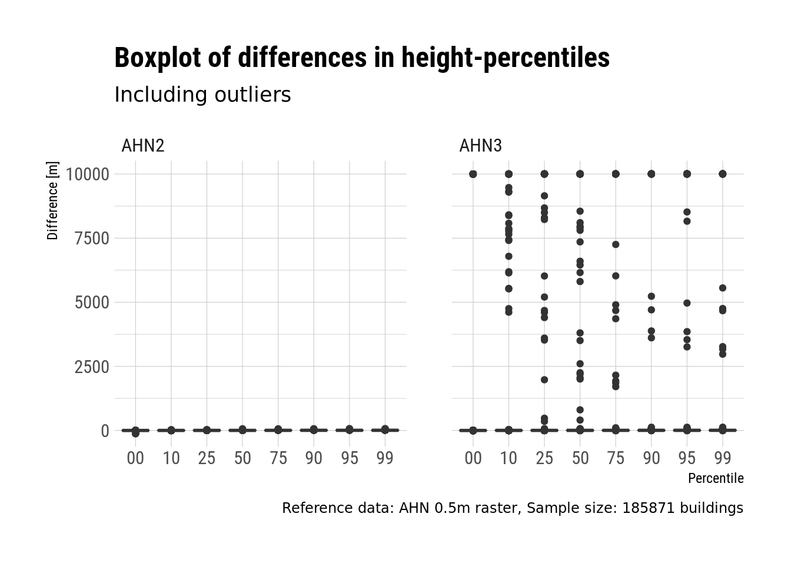
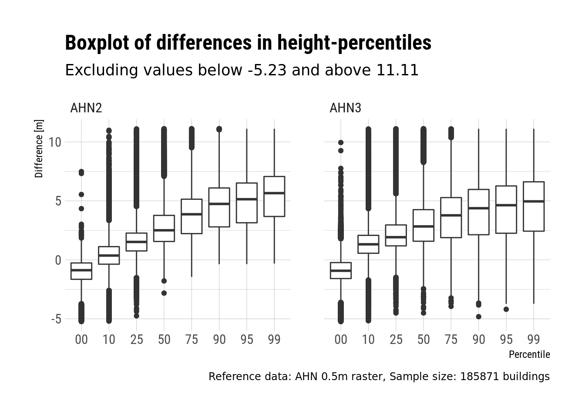
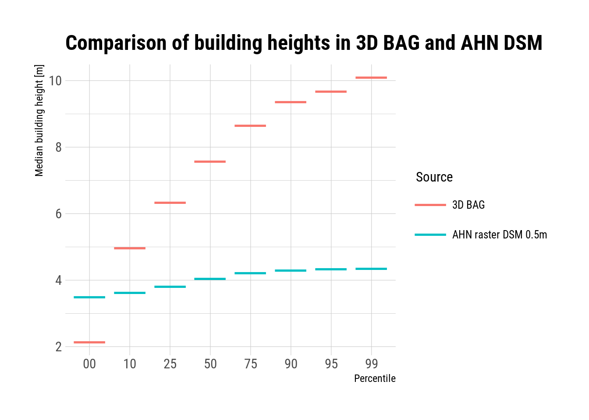

Comparing the 3D BAG heights to the AHN 0.5m DSM
--------------------------------------------------

There are several height values computed for each building. These are
the values of the ground and roof surface at different heights. For
example:

+---------------------------------------+-------------+-------------+-------------+-------------+-------------+-------------+-----------+-----------+-----------+-----------+-----------+-----------+-----------+-----------+
| id                                    | ground-0.00 | ground-0.10 | ground-0.20 | ground-0.30 | ground-0.40 | ground-0.50 | roof-0.00 | roof-0.10 | roof-0.25 | roof-0.50 | roof-0.75 | roof-0.90 | roof-0.95 | roof-0.99 |
+---------------------------------------+-------------+-------------+-------------+-------------+-------------+-------------+-----------+-----------+-----------+-----------+-----------+-----------+-----------+-----------+
| b31bdd44c-00ba-11e6-b420-2bdcc4ab5d7f | -0.03       | 0.01        | 0.02        | 0.02        | 0.03        | 0.04        | -0.03     | 0.01      | 0.02      | 0.04      | 0.11      | 2.36      | 2.38      | 2.44      |
+---------------------------------------+-------------+-------------+-------------+-------------+-------------+-------------+-----------+-----------+-----------+-----------+-----------+-----------+-----------+-----------+

The height values are derived from a point cloud. When using a point
cloud that was acquired by airborne laser scanning (eg. AHN), most of
the points are “on” the roof of the building, and there can be various
amounts of points on the walls.

The AHN 0.5m DSM is used as reference, both AHN2 and AHN3. Our
assumption is that in the higher percentile range (eg. 70-99) the
difference between the 3dfier output and the AHN-raster will be low,
while in the lower percentile range the difference will be high.

The differences in percentiles are computed as:

    difference = 3dbag_percentile - reference_percentile

Where *reference_percentile* is computed with the
`zonal_stats <https://pythonhosted.org/rasterstats/manual.html#zonal-statistics>`_
function of the *rasterstats* python library. The function takes a list
of polygons and computes zonal statistics on a raster for each polygon.
Thus in our case the zonal statistics are *percentile 10, percentile 20
etc.*, which are the same that the 3D BAG contains.

Number of buildings in the test sample: **185871**

The statistical summary together with the box plot confirms that there are some very heavy outliers in the distances that were computed from the AHN3 raster. For now we ignore the reason for having differences in the range of thousands of meters.

+----------+---------+--------+-------+---------+-----------+-------+
| Min.     | 1st Qu. | Median | Mean  | 3rd Qu. | Max.      | NA's  |
+----------+---------+--------+-------+---------+-----------+-------+
| -133.499 | 0.869   | 2.402  | 6.206 | 4.968   | 10012.240 | 17881 |
+----------+---------+--------+-------+---------+-----------+-------+

We the interquartile range to identify and remove the largest outliers. Given that *Q_1* and *Q_3* denote the first and third quartiles, *IQR* denotes the interquartile range, then a data point *p* is considered an outlier if:

    p < Q_1 - (1.5 * IQR)
    
or

    p > Q_3 - (1.5 * IQR)
    
With this method the lower limit for being an outlier is set to *-5.23*, the upper limit to *11.11* meters difference and we remove *1.96%* of the data points. However, the difference in height values is still suspiciously high in the box plots below. They indicate that 2.5–5m height difference is common in the 50th–99th percentile range.

 
Let's take a closer look at the difference between the building heights obtained from the AHN DSM and the 3D BAG. The plot below shows the median building heights across the whole sample at each of the seven percentiles. We can clearly see that in case of the 3D BAG the median height of the buildings is increasing with the percentiles, which is according to the expectation. However, in case of the AHN raster the heights fall very close to 4 meters across all percentiles. This behavior is mainly due to the relatively coarse resolution of the raster and the sampling method for creating the raster. 

