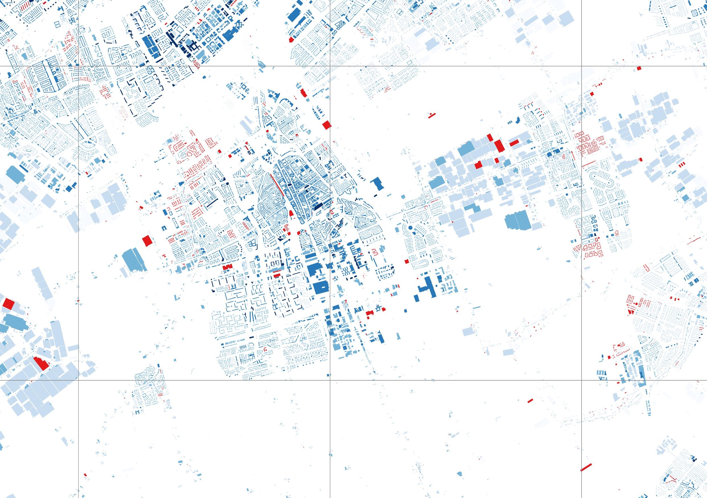

.. bag3d documentation master file, created by
   sphinx-quickstart on Thu May 17 17:10:10 2018.
   You can adapt this file completely to your liking, but it should at least
   contain the root `toctree` directive.

##############################
3D BAG data set and software
##############################

This is the documentation of the 3D BAG data set created by the `3D Geoinformation research group <https://3d.bk.tudelft.nl/>`_ at the Delft University of Technology. This is also the documentation of the **bag3d** software which is used for generating the 3D BAG.

.. toctree::
   :maxdepth: 3
   :caption: Contents:
   
   data
   software
   contact

Indices and tables
==================

* :ref:`genindex`
* :ref:`modindex`
* :ref:`search`
