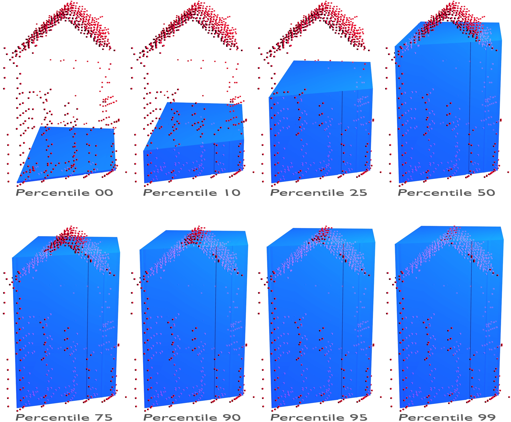

**************
Introduction
**************

.. warning:: This documentation is still under construction!

This is the documentation of the **3D BAG** data set, as well as the ``bag3d`` software that is used for generating the data. The 3D BAG is an enhanced version of the Dutch `Basisregistraties Adressen en Gebouwen (BAG) <https://www.kadaster.nl/wat-is-de-bag>`_ data set, with added height information. The 3D BAG is created and maintained by the `3D geoinformation research group <https://3d.bk.tudelft.nl/>`_ at the Delft University of Technology.

The `Basisregistraties Adressen en Gebouwen (BAG) <https://www.kadaster.nl/wat-is-de-bag>`_ is the most detailed, openly available data set on buildings and addresses in the Netherlands. It contains information about each address in a building, such as its current use, construction date or registration status. The polygons in the BAG represent the footprint of the building as the projection of the roof's outline. The data set is regularly updated as new buildings are registered, built or demolished. The project `NLExtract <http://www.nlextract.nl/>`_ prepares a monthly PostgreSQL backup of the BAG, which is then used as basis for the 3D BAG.

The `Actueel Hoogtebestand Nederland (AHN) <http://www.ahn.nl>`_ is the openly available elevation model of the Netherlands obtained by aerial laser scanning. It is accessible in raster and raw point cloud (LAZ) format. The current is the third version which does not cover the whole country yet, therefore it needs to be extended with the previous version to obtain full coverage. The for disseminating the AHN efficiently, the Netherlands split into 1377 tiles.

The engine behind ``bag3d`` is `3dfier <https://github.com/tudelft3d/3dfier>`_ which takes 2D GIS data sets (e.g BAG) and *3dfies* them by lifting each polygon to a height obtained from a point cloud (e.g. AHN), thus generating LoD1 models (block models). Although for LoD1 building models the top surface (or roof) is set to a uniform height per building, one of the strengths of 3dfier is the possibility to set the height of the top surface at the desired height relative to the points representing the building.

The last piece is `PostgreSQL <https://www.postgresql.org/>`_ which is used for storing the BAG, the *tile indices* and finally storing and serving the 3D BAG. The AHN files are stored in the local file system.

The tiling process
====================

In order to be able to 3dfy any size of data set, the input is processed parallel, tile by tile. Therefore the bottleneck becomes the size of a single tile. Both footprint and point cloud tiles need to be *small* enough, so that ``3dfier`` can process them on your machine. Therefore a central element for ``bag3d`` is the **tile index**.

In ``bag3d`` the term *tile* refers to a data subset (footprints or point cloud), that falls within the limits of a *tile index unit*. A footprint belongs to a tile, if its *centroid* is in the interior of a tile index unit or on the left/lower edge of a tile index unit. Therefore a footprint is guaranteed to belong to only a single tile.

A *tile index* is a polygonal tesselation of the BAG or the AHN. A *tile index unit* is one polygon in the *tile index* and it usually has an *ID* (e.g. 1) and a *name* (e.g. 25gn1) that uniquely identifies it. This concept is used by the `AHN tile index <http://www.ahn.nl/binaries/content/assets/ahn-nl/downloads/ahn_units.zip>`__, which served as an example for development.

In the 3D BAG, the AHN tile index is used for partitioning the BAG thus the AHN and BAG tiles are equivalent, both in geometry and ID. But matching footprint and point cloud tiles is not a requirement as for each footprint tile the intersecting point cloud tiles are selected. And in case you are wondering how to generate a tile index, the *Create grid* Processing algorithm in QGIS might be a good starting point.

The two AHN versions
=====================

The missions for acquiring the AHN2 and AHN3 lasted 2007–2012 and 2014–2019 respectively. Thus AHN3 does not cover the whole Netherlands yet and it is expected to be complete by the end of 2019. Until then, parts of the previous version (AHN2) need to be used for achieving a complete coverage of heights. One of the main arguments against the AHN in general that is deemed to be out dated by design, due to long mission times for acquiring the scans. However, the building stock changes in a relatively slow pace, this pace being faster in metropolitan regions and even slower in remote areas of the country. In fact, our analysis shows that 96.33% of the measured building heights are still valid. This means that the respective point cloud and the age of the building are related.

LoD1 building models with different heights
=============================================

TODO

3D BAG Attribute description
=================================

``gid``: geometry ID, used internally

from ``identificatie`` to ``einddatumtijdvakgeldigheid``: attributes directly taken from the BAG, for more information see the `BAG documentation <https://imbag.github.io/praktijkhandleiding/>`_

``geovlak``: geometry of the footprint

from ``ground-00`` to ``ground-50``: the height of the ground surface of the building at the given percentile

from ``roof-00`` to ``roof-99``: the height of the roof surface of the building at the given percentile. For example ``roof-99`` is the height of the building when the roof surface is set at the 99th percentile of the z-coordinates of the point cloud of the building.

``ahn_version``: the version of the AHN that was used to obtain the height information

``ahn_file_date``: the creation date of the AHN file that was used to obtain the height information

``tile_id``: the ID of the tile where the building belongs to

The 3D BAG compared to similar data sets
==========================================

For details on the quality of the 3D BAG, also in comparison with similar data sets, see :ref:`quality`.