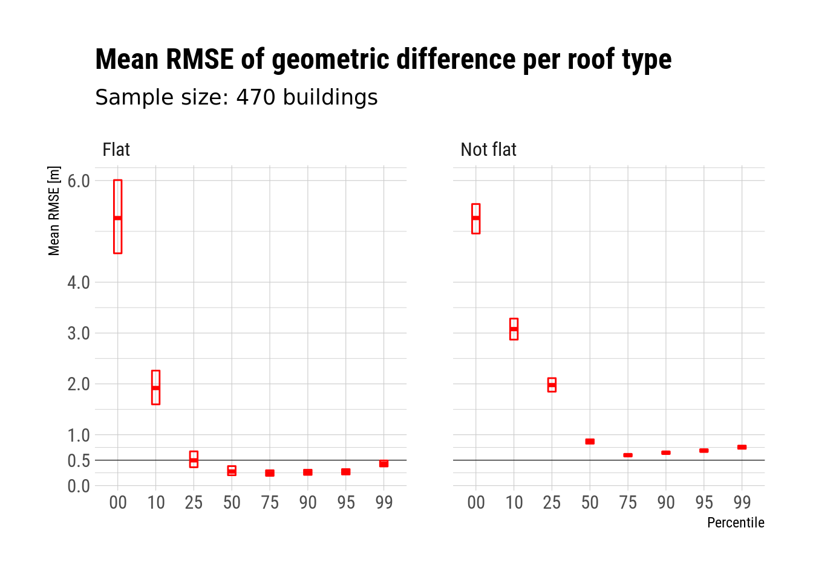

.. _quality:

************************
Quality of the 3D BAG
************************

Quality expectations
=======================

These quality expectations describe the 3D-part of the 3D BAG. The quality of the BAG itself is not discussed here.

Completeness
-------------

* Every BAG building footprint polygon should have a height assigned to it wherever AHN has data.

* The date of AHN (height information) is assigned to every footprint. This includes the AHN version.

* The binary attribute `flat_roof` is assigned to every footprint with height information.

Correctness
------------

* Which part of the roof does `roof-0.00`, `roof-0.50` and `roof-0.99` relate to in the real building?

* The newest avialable AHN is used for every footprint.

Accountability
----------------

* The source of BAG and AHN is clearly stated.

* Logging into the `bagactueel.bag3d_log` table.

* Data quality testing summary into the `bagactueel.bag3d_info` table.

Quality testing
=================

The following quality metrics are computed with every update:

+-----------------------------------------------------+---------+
| Total nr. buildings                                 | 9989779 |
+-----------------------------------------------------+---------+
| Buildings with valid height                         | 96.33%  |
+-----------------------------------------------------+---------+
| Buildings missing height information for the roof   | 0.87%   |
+-----------------------------------------------------+---------+
| Buildings missing height information for the ground | 0.87%   |
+-----------------------------------------------------+---------+

Additional to the metrics above, it is good to have an estimate on how well does a building model approximate the geometry of its real-world counter part. Therefore we computed the root mean square error (RMSE) of the geometric difference between the point cloud and the 3D building model at each percentile for 470 buildings in two areas of Delft. The *geometric difference* is represented by the shortest absolute distances *from* all point in the point cloud *to* the building model. Only those points are used from the point cloud that contribute to the creation of the 3D model.

The diagram of the RMSE of geometric difference, grouped by the type of the roof.

3D gebouwhoogte NL
-------------------

The `3D gebouwhoogte NL <https://www.kadaster.nl/-/3d-gebouwhoogte-nl>`_ data set is probably what is the closest to what the 3D BAG offers. There are two major differences however. First, the 3D BAG is continuously updated along with the BAG while the 3D geobouwhoogte was last updated in 2015 and the heights are based on the AHN2. Second, the 3D geobouwhoogte is generated from a map of 1:10000 scale, thus the geometry of the building footprints are considerably less detailed than those in the BAG.

Esri's 3D BAG
--------------

The GIS software company Esri offers open data set which is based on the BAG and AHN too (eg. `provinces <https://hub.arcgis.com/items/esrinl-content::bag-3-d-provincies-1>`_. However, it is not clear whether the height information is still relevant for each building, neither it is stated what the top surface in the model relates to in the real world. These properties make the data set unsuitable for noise simulations for example.

.. include:: ahn.rst
